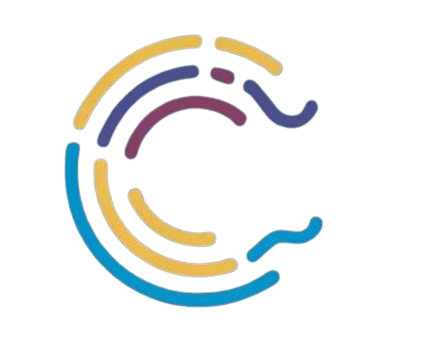

  

# Código de Conduta para Contribuidores

## Nossa Promessa

No interesse de fomentar um ambiente aberto e acolhedor, nós, como colaboradores e mantenedores, comprometemo-nos a fazer a participação em nosso projeto e em nossa comunidade uma experiência livre de assédio para todos, independentemente de idade, porte físico, deficiência, etnia, identidade e expressão de gênero, nível de experiência, nacionalidade, aparência pessoal, raça, religião ou identidade e orientação sexual.

## Nossos Padrões

Exemplos de comportamento que contribuem para criar um ambiente positivo incluem:

- Usar linguagem acolhedora e inclusiva
- Respeitar pontos de vista e experiências diferentes
- Aceitar críticas construtivas com graça
- Focar no que é melhor para a comunidade
- Mostrar empatia com outros membros da comunidade

Exemplos de comportamento inaceitável pelos participantes incluem:

- Uso de linguagem ou imagens sexualizadas e atenção ou avanços sexuais indesejados
- Comentários insultuosos ou depreciativos e ataques pessoais ou políticos (trolling)
- Assédio público ou privado
- Publicar informações pessoais de outras pessoas, como um endereço físico ou eletrônico, sem permissão explícita
- Outras condutas que podem ser razoavelmente consideradas inapropriadas em um ambiente profissional

## Nossas Responsabilidades

Os mantenedores do projeto são responsáveis por esclarecer os padrões de comportamento aceitável e devem tomar ações corretivas apropriadas e justas em resposta a qualquer instância de comportamento inaceitável.

Os mantenedores do projeto têm o direito e a responsabilidade de remover, editar ou rejeitar comentários, commits, código, edições de wiki, issues e outras contribuições que não estejam alinhadas com este Código de Conduta, ou de banir temporariamente ou permanentemente qualquer colaborador por outros comportamentos que considerem inadequados, ameaçadores, ofensivos ou prejudiciais.

## Escopo

Este Código de Conduta se aplica tanto nos espaços do projeto quanto nos espaços públicos quando um indivíduo está representando o projeto ou sua comunidade. Exemplos de representação do projeto ou da comunidade incluem usar um endereço de e-mail oficial do projeto, postar via uma conta oficial de mídia social, ou agir como um representante designado em um evento online ou offline. A representação de um projeto pode ser ainda definida e esclarecida pelos mantenedores do projeto.

## Aplicação

Instâncias de comportamento abusivo, assediador ou de outra forma inaceitável podem ser relatadas entrando em contato com a equipe do projeto através do [INSERIR MÉTODO DE CONTATO]. Todas as reclamações serão revisadas e investigadas e resultarão em uma resposta considerada necessária e apropriada às circunstâncias. A equipe do projeto é obrigada a manter a confidencialidade em relação ao relator de um incidente. Detalhes adicionais de políticas de aplicação podem ser postadas separadamente.

Mantenedores do projeto que não seguirem ou aplicarem o Código de Conduta de boa fé podem enfrentar repercussões temporárias ou permanentes conforme determinado por outros membros da liderança do projeto.

---

## Atribuição

Este Código de Conduta foi criado e idealizado por ***Kassia Albuquerque***.

---

### Gostaríamos muito de ouvir de você! 

Para dúvidas, sugestões ou mais informações sobre nossos serviços, entre em contato conosco pelo e-mail StartUpConnectionFuture@gmail.com ou pelo telefone (13) 99628-7594. 

###### Estamos aqui para ajudar!

